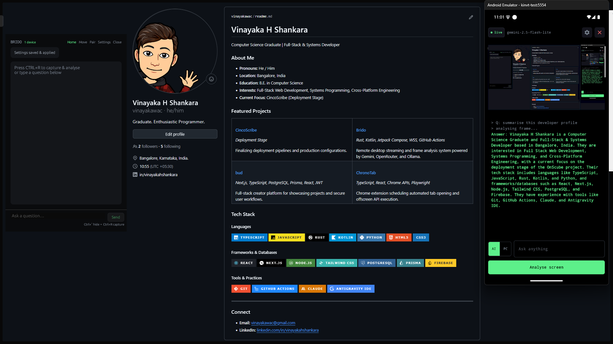
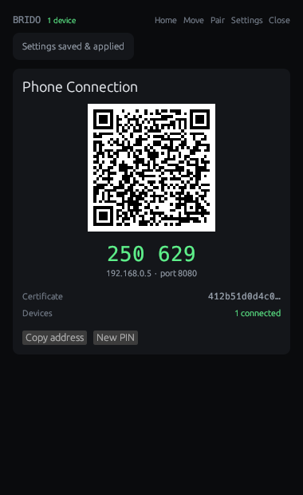
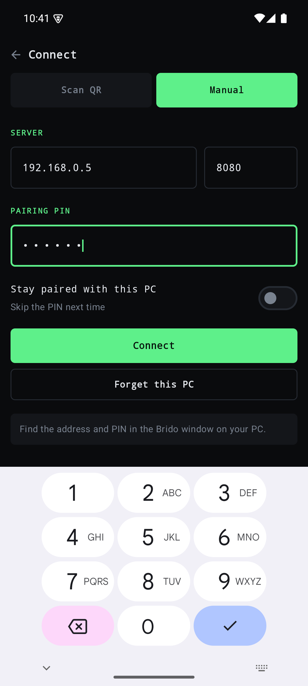
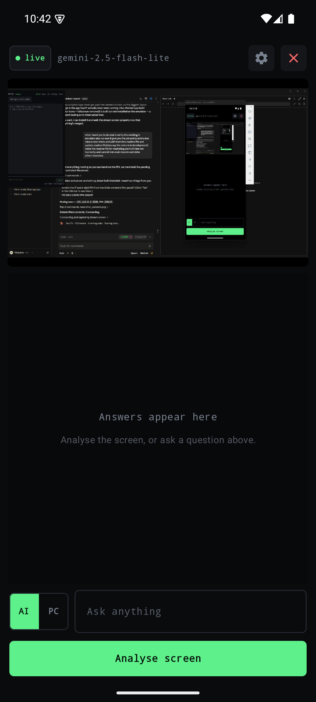
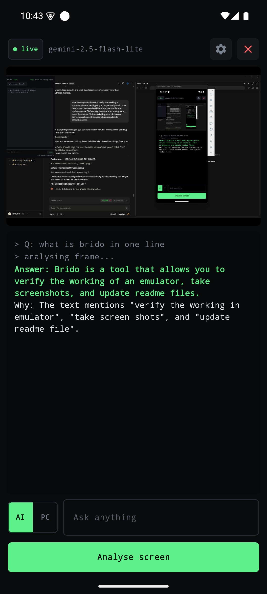
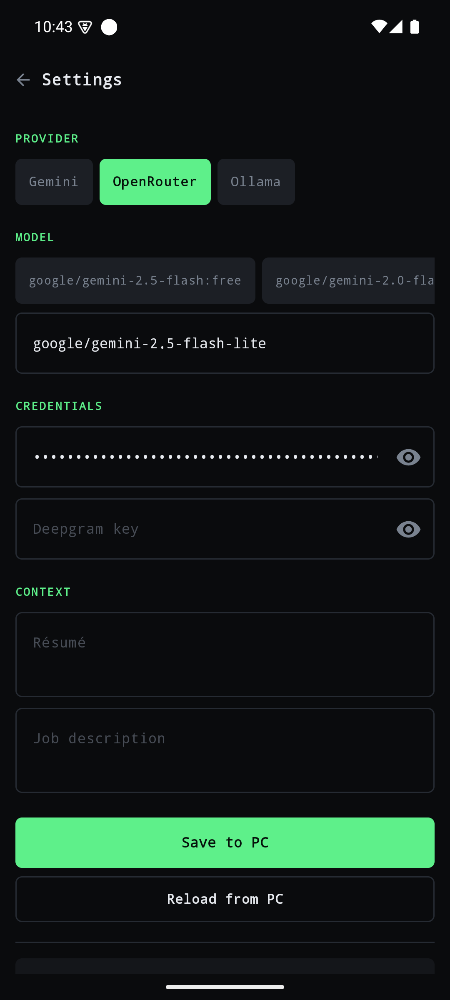
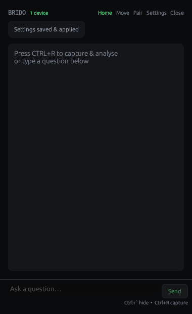

<div align="center">


# brido

### Your laptop screen, on your phone — with an AI that answers what's on it.

[](brido_server/)
[](brido_app/)
[](#license)



</div>

---

## What it does

Brido puts your laptop screen on your phone, live. Then, whenever you want, it
asks an AI about whatever is on that screen — and answers appear on the phone.

It's two small pieces that pair in about ten seconds:

- A **desktop app** that shares your screen and stays out of the way.
- A **phone app** that shows the screen and does the asking.

No cloud service in between. Your laptop talks to your phone over your own
Wi‑Fi, and nothing leaves your network except the AI request itself.

---

## Why people use it

**Read your laptop from across the room.** Cooking, on the treadmill, wiring
something under a desk — the screen comes with you.

**Ask about what you're looking at.** A stack trace, a form in a language you
don't read, a chart, an error dialog. Tap **Analyse screen** and get a plain
answer.

**Ask about anything else, too.** The input box is a normal chatbot. Questions
don't have to relate to the screen at all.

**Type on your PC from the couch.** Flip the toggle from **AI** to **PC** and
your phone becomes a keyboard — text lands wherever the cursor is, arrow keys
and backspace included.

---

## Getting started

### 1 · Start the desktop app

```bash
cd brido_server
cargo run --release
```

A small panel appears. On first run it asks which AI provider to use — Gemini,
OpenRouter, or Ollama if you'd rather run a model on your own machine.

### 2 · Pair your phone

Click **Pair**. Scan the QR code with the app, or type the address and PIN.

<div align="center">

</div>

The QR carries a fingerprint of your laptop's certificate, so the phone knows
it's talking to *your* machine and not something pretending to be it. Tick
**Stay paired** and you can skip the PIN next time.

### 3 · That's it

Your screen is on your phone.

---

## A look around

<div align="center">

| Connect | Live screen | An answer |
|:---:|:---:|:---:|
|  |  |  |
| Scan a code or type the address | Your laptop, mirrored live | Ask anything, on-screen or not |

</div>

<div align="center">

| Phone settings | Desktop panel |
|:---:|:---:|
|  |  |
| Change provider, model and keys from the phone — they sync both ways | Answers, copyable, out of the way |

</div>

---

## Your keys stay yours

Settings sync from your desktop to your phone the moment you connect, so you can
switch model or paste a key from either side. On the phone they live **in memory
only** — never written to storage, and wiped the second you disconnect, even for
a device you've marked as trusted.

Pairing is protected by a PIN that can't be brute-forced, sessions expire on
their own, and the connection is pinned to your laptop's certificate. Your API
keys are used by your own machine, and go nowhere else.

---

## Handy to know

- **Hotkeys** — `Ctrl+R` capture and analyse · `` Ctrl+` `` hide the panel ·
  `Ctrl+.` type straight into the box. All rebindable in Settings.
- **Bring your own model** — Gemini, OpenRouter, or Ollama running locally.
- **Runs quietly** — the desktop panel floats above your work and can hide
  itself from screen capture and screen sharing.
- **Voice input is in development** — the groundwork is in, but it isn't ready
  yet, so it's hidden for now.

---

## Under the hood

| Path | What's inside |
|:---|:---|
| `brido_server/` | Desktop app and server — Rust, HTTPS/WSS, screen capture |
| `brido_app/` | Phone app — Kotlin and Jetpack Compose |
| [`ARCHITECTURE.md`](ARCHITECTURE.md) | How the pieces fit together |
| [`API.md`](API.md) | Endpoints and payloads |
| [`SETUP.md`](SETUP.md) | Detailed setup |
| [`TROUBLESHOOTING.md`](TROUBLESHOOTING.md) | When something won't connect |

**Requirements** — Windows for the desktop app, Android 7.0 or newer for the
phone, and both on the same Wi‑Fi.

---

## Support the project

Brido is free and open source. If it's useful to you, buying a coffee keeps it
moving.

<div align="center">

[](https://ko-fi.com/F2Q7236MTE)

</div>

---

## License

Apache 2.0. See [LICENSE](LICENSE).
